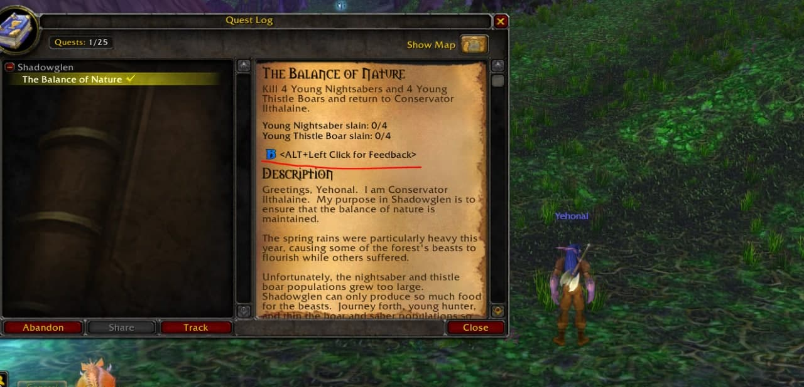

# FeedbackUI

Client Addon for the Feedback UI: in-game survey, feedback and bugreport 

## Installation

To install the addon you must create a folder inside your /Data/ directory.

This folder must be called "patch-X.MPQ" where X can be any value between 4-9 and A-Z.

You can copy the content of this repository inside that folder then.

Alternatively you can directly clone the repository within the /Data/ folder with this command:

```
git clone https://github.com/wowgaming/FeedbackUI patch-X.MPQ
```

Remember to replace the X with the character you prefer.

## How to use

This addon should be enabled by default (otherwise you can enable it within the list of the addons at the character creation).
When you login with your character it will be displayed around the minimap 


You can open the UI by using that button, otherwise you can leave a feedback of a specific quest/item/spell/npc by clicking with ALT+Left click on them.

This feedbacks will be sent to the server and will be used by internally used by the staff.

## In game video

[](https://www.youtube.com/watch?v=QHA_k-cOj_8)

## Screnshots





